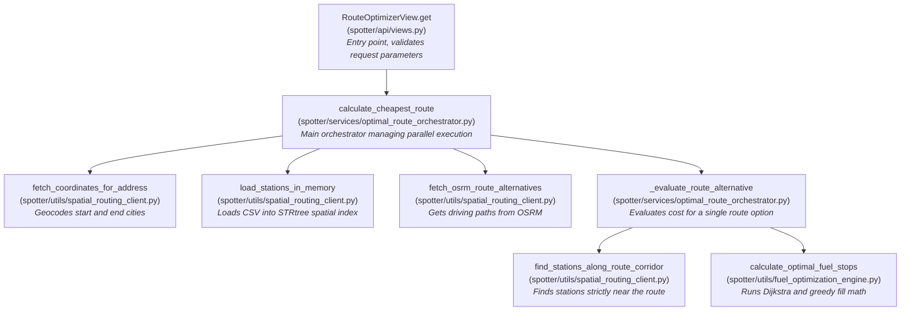
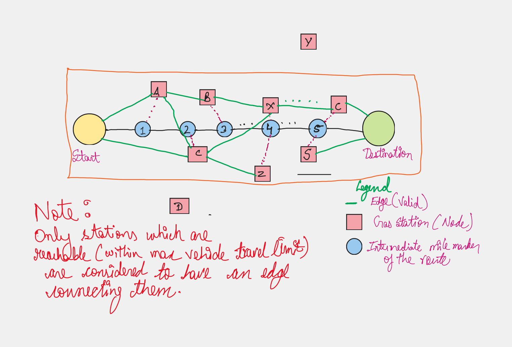
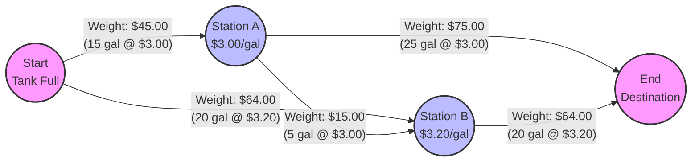

# Spotter Optimal Routing Engine

Spotter is a high-performance routing API built on Django that calculates the most cost-effective fueling strategy for long-haul trucking. It integrates directly with OSRM (Open Source Routing Machine) to compute driving routes, and uses a custom Dijkstra-based graph algorithm to minimize fuel costs based on real-time station data.

## The Algorithm Flow

At its core, Spotter models fuel optimization as a shortest-path graph problem, executing in several high-speed phases:

### 1. Route Generation & Spatial Indexing
When a user requests a route (e.g., Chicago to Denver):
- **Geocoding:** The start and end cities are converted to coordinates using the OpenRouteService API.
- **Route Fetching:** Spotter queries OSRM to retrieve the physical geometry of the driving route.
- **Spatial Filtering (STRtree):** The system maintains an `STRtree` (Sort-Tile-Recursive spatial index) of over 30,000 national fuel stations. It draws a "buffer polygon" over the route geometry and instantly culls out stations that are too far away.
- **Segment Projection:** The surviving candidate stations are projected onto the nearest highway segments to calculate exact "mile markers" and the precise off-route detour distances.

### 2. Graph Optimization (The "Fill-To-Full" Model)
The perfectly ordered list of stations is fed into `fuel_optimization_engine.py`.
- **Dijkstra's Pathfinding:** The engine builds a directed graph where nodes are stations and edges are driving segments. The edge weights represent the **cost of fuel burned**. 
  - *The brilliance of the algorithm:* In a "fill-to-full" strategy, you arrive at a station and replenish the exact amount of fuel you burned driving there. Therefore, the financial cost of driving a leg is calculated using the price of fuel at the **destination** station.
  - Dijkstra evaluates every possible sequence of stops and finds the absolute minimum theoretical cost path.

### 3. Greedy Refinement
Dijkstra assumes you always fill to the top. The final pass is a "Greedy Look-Ahead" refinement. It walks the Dijkstra-selected path and determines exactly how many gallons to buy:
- If the next station is cheaper, it only buys enough gas to reach it.
- If the next station is more expensive, it fills the tank to the top to delay buying expensive gas.
- At the final stop, it only buys exactly what is needed to reach the destination plus a safety buffer.

---

### 4. Function Call Graph
The following diagram illustrates the flow of execution from the API view down to the core utility functions:



### 5. Example Graph Representation
## Example Graph



During execution, the algorithm builds a directed graph to find the shortest path based on fuel cost. Below is a simplified visualization:

- **Nodes**: Represent the start, end, and valid gas stations along the way.
- **Edges**: Represent the drivable legs between nodes.
- **Weights**: The total dollar cost to drive that leg (gallons burned × price of fuel at the destination node).


*Note: In the fill-to-full strategy, when you drive from Start to Station A, you arrive and refill the fuel you just burned using Station A's price. The weight is the actual financial cost incurred at the pump.*

---

## Codebase Architecture

The project adheres strictly to Domain-Driven Design principles. Each layer only communicates downwards.

```text
spotter/
├── api/
│   ├── views.py                           # The REST API boundary
│   └── serializers.py                     # Input validation schemas
│
├── services/
│   └── optimal_route_orchestrator.py      # The Conductor. Orchestrates spatial data, OSRM, and the engine.
│
├── utils/
│   ├── fuel_optimization_engine.py        # The Math. Handles Dijkstra graphs and the greedy fill logic.
│   ├── spatial_routing_client.py          # The Map. Handles OSRM requests and STRtree station mapping.
│   └── geo.py                             # The Geometry. Haversine distance and vector projections.
│
└── core/
    ├── config.py                          # Environment variable bindings
    └── constants.py                       # Physical truck constants (MPG, Tank Capacity)
```

---

## Local Setup & Installation

Follow these steps to run the engine locally:

### 1. Environment Preparation
Ensure you have Python 3.10+ installed.
```bash
# Create and activate a virtual environment
python -m venv venv
source venv/bin/activate  # On Windows use: venv\Scripts\activate

# Install dependencies
pip install -r requirements.txt
```

### 3. Database & Server
Apply the initial Django migrations and boot the server.
```bash
python manage.py migrate
python manage.py runserver
```

The API will now be available at `http://localhost:8000/api/route/`.

Example api run: `http://localhost:8000/api/route/?start_address=Chicago,IL&destination_address=Denver,CO&buffer_gallons=0&greedy_fill=false`
